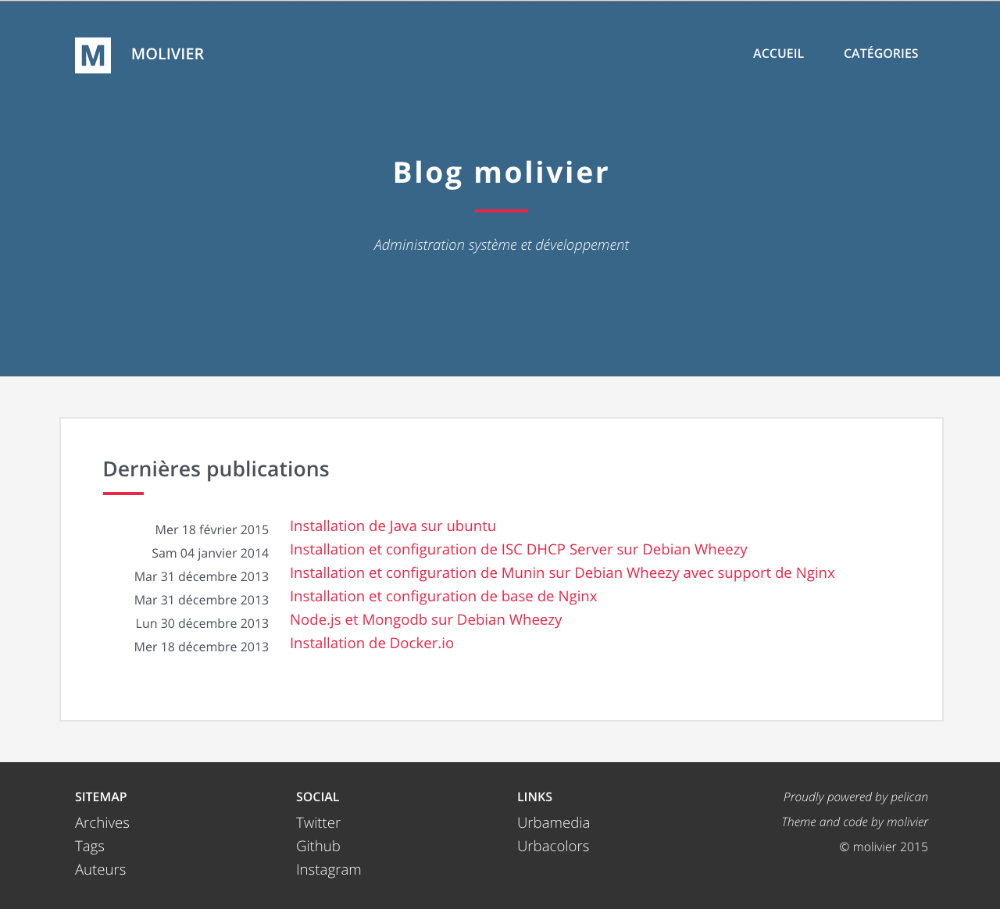
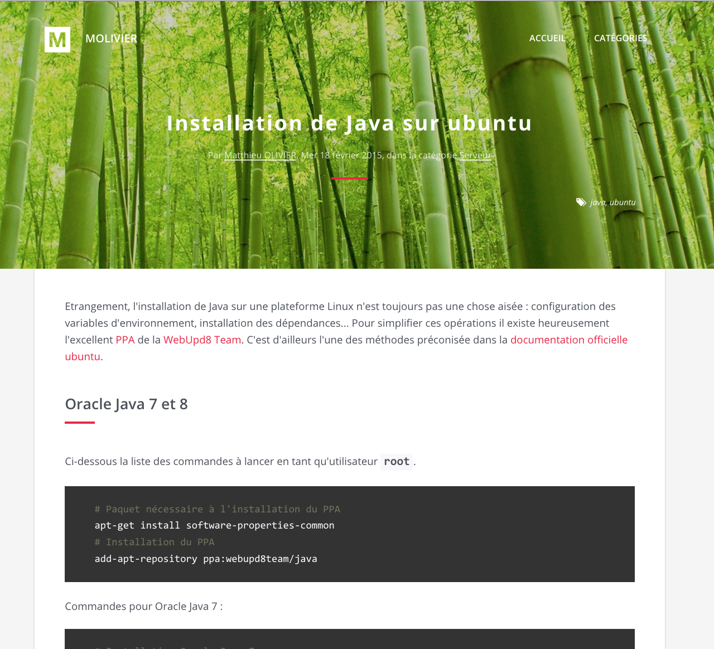
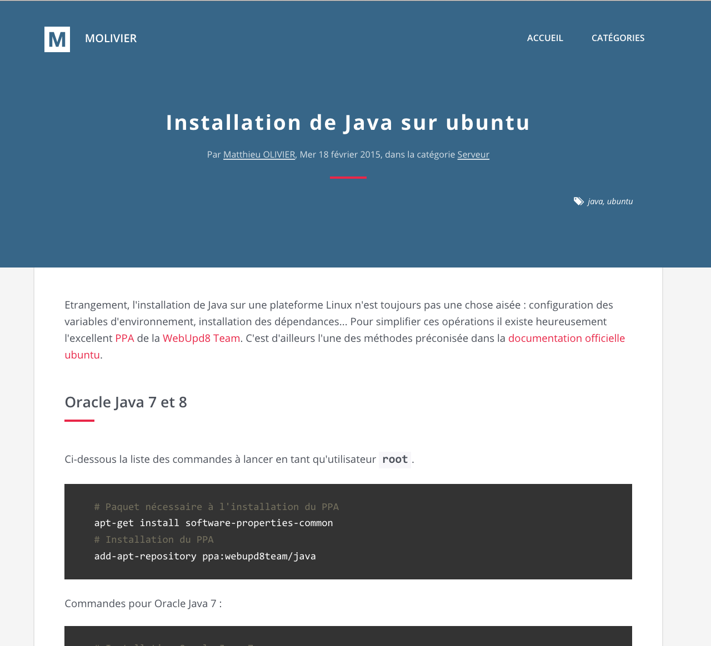
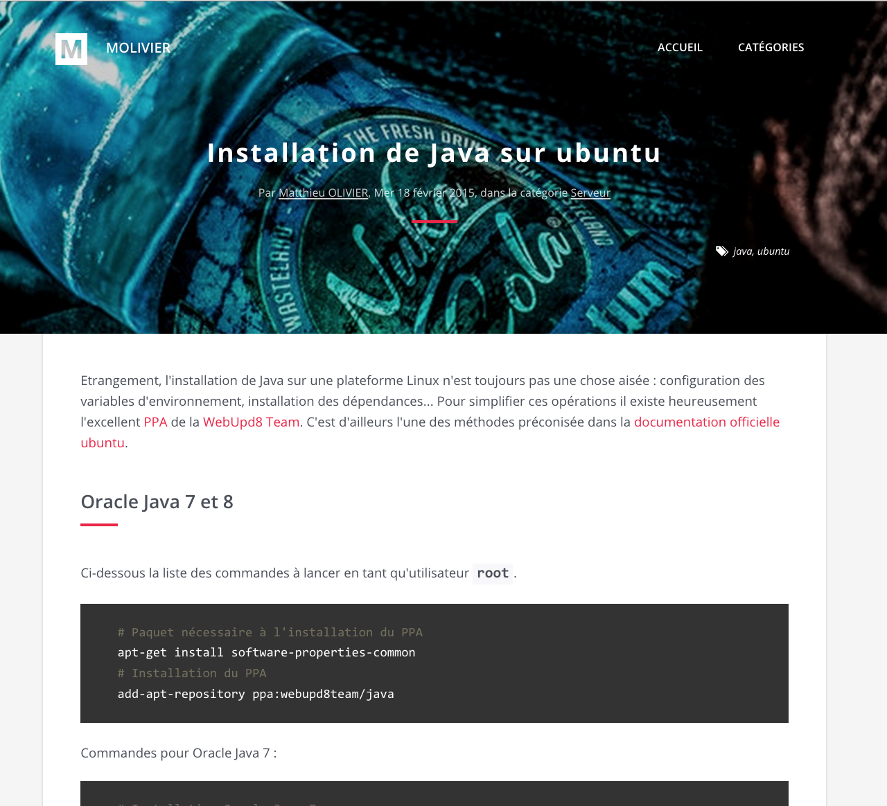

# Nest

Nest is a theme for [Pelican](http://getpelican.com) 3.5+, a static site generator written in Python.

I initially created this theme for [my blog](http://www.molivier.com), but now the theme is supposed to be generic enough to have its own repository.

## Screenshots

### Homepage



### Homepage with background



Add a background image by configuring `NEST_HEADER_IMAGES` parameter in your pelican.conf. Image should be located in `content/images` directory.

### Article



### Article or page with background



Add a background image by adding `Illustration` custom parameter in your markdown article or page. Image should be located in `content/images` directory.

	Title: Ubuntu Install
	Date: 2015-02-18 16:00
	Category: server
	Tags: ubuntu, kernel
	Slug: ubuntu-install
	Author: Matthieu OLIVIER
	Illustration: background.jpg


## Features

* Featured site header image
* Featured article header image
* **Pygments** syntax highlighting
* **Disqus** support for comments
* **Google Analytics** support
* **Piwik** support
* RSS and Atom feeds

## Settings

Nest template can be customized by adding parameters to your `pelicanconf.py` file. Template specifics parameters are prefixed with template name.

### Pelican.conf example

```python
# NEST Template
THEME = 'nest'
SITESUBTITLE = u'My Awesome Blog'
# Minified CSS
NEST_CSS_MINIFY = True
# Add items to top menu before pages
MENUITEMS = [('Homepage', '/'),('Categories','/categories.html')]
# Add header background image from content/images : 'background.jpg'
NEST_HEADER_IMAGES = ''
NEST_HEADER_LOGO = '/image/logo.png'
# Footer
NEST_SITEMAP_COLUMN_TITLE = u'Sitemap'
NEST_SITEMAP_MENU = [('Archives', '/archives.html'),('Tags','/tags.html'), ('Authors','/authors.html')]
NEST_SITEMAP_ATOM_LINK = u'Atom Feed'
NEST_SITEMAP_RSS_LINK = u'RSS Feed'
NEST_SOCIAL_COLUMN_TITLE = u'Social'
NEST_LINKS_COLUMN_TITLE = u'Links'
NEST_COPYRIGHT = u'&copy; blogname 2015'
# Footer optional
NEST_FOOTER_HTML = ''
# index.html
NEST_INDEX_HEAD_TITLE = u'Homepage'
NEST_INDEX_HEADER_TITLE = u'My Awesome Blog'
NEST_INDEX_HEADER_SUBTITLE = u'Smashing The Stack For Fun And Profit'
NEST_INDEX_CONTENT_TITLE = u'Last Posts'
# archives.html
NEST_ARCHIVES_HEAD_TITLE = u'Archives'
NEST_ARCHIVES_HEAD_DESCRIPTION = u'Posts Archives'
NEST_ARCHIVES_HEADER_TITLE = u'Archives'
NEST_ARCHIVES_HEADER_SUBTITLE = u'Archives for all posts'
NEST_ARCHIVES_CONTENT_TITLE = u'Archives'
# article.html
NEST_ARTICLE_HEADER_BY = u'By'
NEST_ARTICLE_HEADER_MODIFIED = u'modified'
NEST_ARTICLE_HEADER_IN = u'in category'
# author.html
NEST_AUTHOR_HEAD_TITLE = u'Posts by'
NEST_AUTHOR_HEAD_DESCRIPTION = u'Posts by'
NEST_AUTHOR_HEADER_SUBTITLE = u'Posts archives'
NEST_AUTHOR_CONTENT_TITLE = u'Posts'
# authors.html
NEST_AUTHORS_HEAD_TITLE = u'Author list'
NEST_AUTHORS_HEAD_DESCRIPTION = u'Author list'
NEST_AUTHORS_HEADER_TITLE = u'Author list'
NEST_AUTHORS_HEADER_SUBTITLE = u'Archives listed by author'
# categories.html
NEST_CATEGORIES_HEAD_TITLE = u'Categories'
NEST_CATEGORIES_HEAD_DESCRIPTION = u'Archives listed by category'
NEST_CATEGORIES_HEADER_TITLE = u'Categories'
NEST_CATEGORIES_HEADER_SUBTITLE = u'Archives listed by category'
# category.html
NEST_CATEGORY_HEAD_TITLE = u'Category Archive'
NEST_CATEGORY_HEAD_DESCRIPTION = u'Category Archive'
NEST_CATEGORY_HEADER_TITLE = u'Category'
NEST_CATEGORY_HEADER_SUBTITLE = u'Category Archive'
# pagination.html
NEST_PAGINATION_PREVIOUS = u'Previous'
NEST_PAGINATION_NEXT = u'Next'
# period_archives.html
NEST_PERIOD_ARCHIVES_HEAD_TITLE = u'Archives for'
NEST_PERIOD_ARCHIVES_HEAD_DESCRIPTION = u'Archives for'
NEST_PERIOD_ARCHIVES_HEADER_TITLE = u'Archives'
NEST_PERIOD_ARCHIVES_HEADER_SUBTITLE = u'Archives for'
NEST_PERIOD_ARCHIVES_CONTENT_TITLE = u'Archives for'
# tag.html
NEST_TAG_HEAD_TITLE = u'Tag archives'
NEST_TAG_HEAD_DESCRIPTION = u'Tag archives'
NEST_TAG_HEADER_TITLE = u'Tag'
NEST_TAG_HEADER_SUBTITLE = u'Tag archives'
# tags.html
NEST_TAGS_HEAD_TITLE = u'Tags'
NEST_TAGS_HEAD_DESCRIPTION = u'Tags List'
NEST_TAGS_HEADER_TITLE = u'Tags'
NEST_TAGS_HEADER_SUBTITLE = u'Tags List'
NEST_TAGS_CONTENT_TITLE = u'Tags List'
NEST_TAGS_CONTENT_LIST = u'tagged'
# Static files
STATIC_PATHS = ['images', 'extra/robots.txt', 'extra/favicon.ico', 'extra/logo.svg']
EXTRA_PATH_METADATA = {
    'extra/robots.txt': {'path': 'robots.txt'},
    'extra/favicon.ico': {'path': 'favicon.ico'},
    'extra/logo.svg': {'path': 'logo.svg'}
}
```


## Third-party assets

The theme uses external softwares, scripts, libraries and artworks:

* [Bootstrap](http://getbootstrap.com/) 3.x.x
* [Open Sans Font](http://www.google.com/fonts/specimen/Open+Sans)
